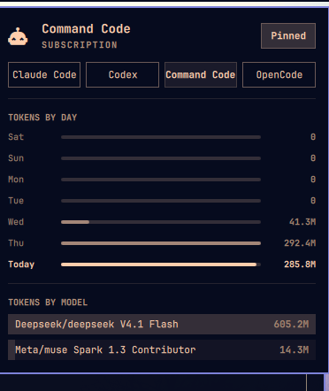

# Command Code Usage for Omarchy

Shows `command-code` / `cmd` usage in the Omarchy agents panel, following the
pattern of
[`wellatleastitried/omarchy-copilot-panel-usage`](https://github.com/wellatleastitried/omarchy-copilot-panel-usage).



## How it works

- `bin/omarchy-agent-usage-commandcode` scans `~/.commandcode/projects/*/*.jsonl`
  (skipping `*.checkpoints.jsonl` and `*.prompts.jsonl`), tallies prompts and
  tokens per day and per model, and writes
  `~/.local/state/omarchy/agents/usage/commandcode.json`.
- `ui/main.qml` runs the collector every 5 minutes and whenever the usage
  directory changes — same as the Copilot plugin.
- The agents panel picks up the new tab automatically once the JSON record
  exists. Nothing under `/usr/share/omarchy` is touched.

## Install

```bash
omarchy plugin add https://github.com/jhonoryza/omarchy-commandcode-usage.git --enable
```

## Removal

```bash
omarchy plugin remove dell.commandcode-usage
```

## Manual test

```bash
~/.config/omarchy/plugins/dell.commandcode-usage/bin/omarchy-agent-usage-commandcode | head -n 40
~/.config/omarchy/plugins/dell.commandcode-usage/bin/omarchy-agent-usage-commandcode --write
cat ~/.local/state/omarchy/agents/usage/commandcode.json | head -n 40
omarchy plugin validate ~/.config/omarchy/plugins/dell.commandcode-usage
omarchy-shell shell rescanPlugins
```

## Notes

- Command Code exposes no public quota endpoint, so `limits` stays empty —
  what you get is local stats: today, the last 7 days, and all-time totals
  per model.
- The panel resolves provider icons from the *agents* plugin's `assets/`
  directory, so a custom `commandcode.svg` belongs there (see
  [omarchy-agents-pin](https://github.com/jhonoryza/omarchy-agents-pin)),
  not in this repo. Without one the panel falls back to its default glyph.

## Dependencies

- Python 3 (standard library only, no extra packages).
- Command Code CLI sessions under `~/.commandcode/projects/` (respects
  `COMMANDCODE_HOME` if set). Nothing is written outside
  `~/.local/state/omarchy/agents/usage/`.

## License

MIT
